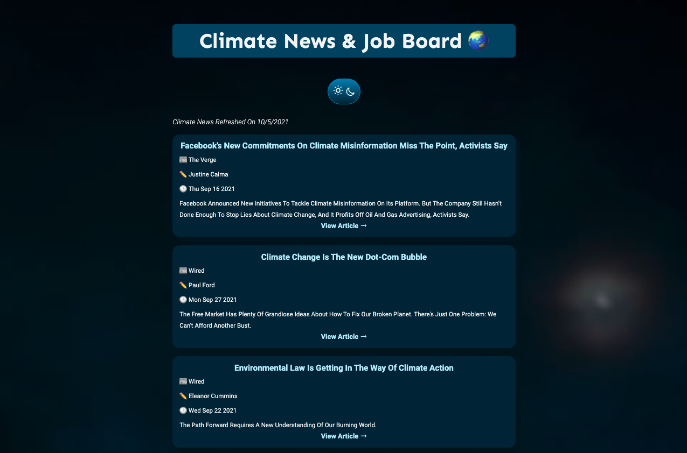

# *Climate News & Job Board*

Deployed on Heroku: <https://env-news-api.herokuapp.com/>

Learn More About the Developer: www.linkedin.com/in/genneliu/

 *Climate News & Job Board* is a web application that draws Climate news from News API and displays Climate related job postings. Visitors are able to go directly to the articles, post new jobs to the job board, and apply to jobs via links. 

 As someone who worked in the environmental field, this app was inspired by a recent conversation I had with a friend; we often discuss how difficult it is to find environmental news and jobs compared to other fields. 

 ### Project Background
 This is my final project for the DevMountain Foundations course. Special thanks to my instructors Stuart, DJ, and Adam. 

#### Technology 
⋅⋅* Javascript
⋅⋅* HTML
⋅⋅* CSS
⋅⋅* Express
⋅⋅* Axios
⋅⋅* News API

#### Displayed News Articles

#### Job Board

#### Backend 
The backend runs on Express and utilizes Axios for making requests. All other installed depencies can be seen at the bottom of the document. 

The news articles are derived from [News API](https://newsapi.org) with the search query "climate". 

At this moment, the jobs board is populated by a json file located at the backend. 

#### Light/Dark Toggle

#### Future Plans
Some ideas going in to the future include:
⋅⋅* Storing light/dark preference so returning visitors may land on their chosen mode
⋅⋅* Adding an API to populate Climate Jobs
⋅⋅* Adding an account system
⋅⋅* Creating a database so the jobs users submit may be saved indefinitely

###### Dependencies
axios: ^0.21.4,
cors: ^2.8.5,
dotenv: ^10.0.0,
express: ^4.17.1,
path: ^0.12.7,
postinstall": ^0.7.3,
route: ^0.2.5
